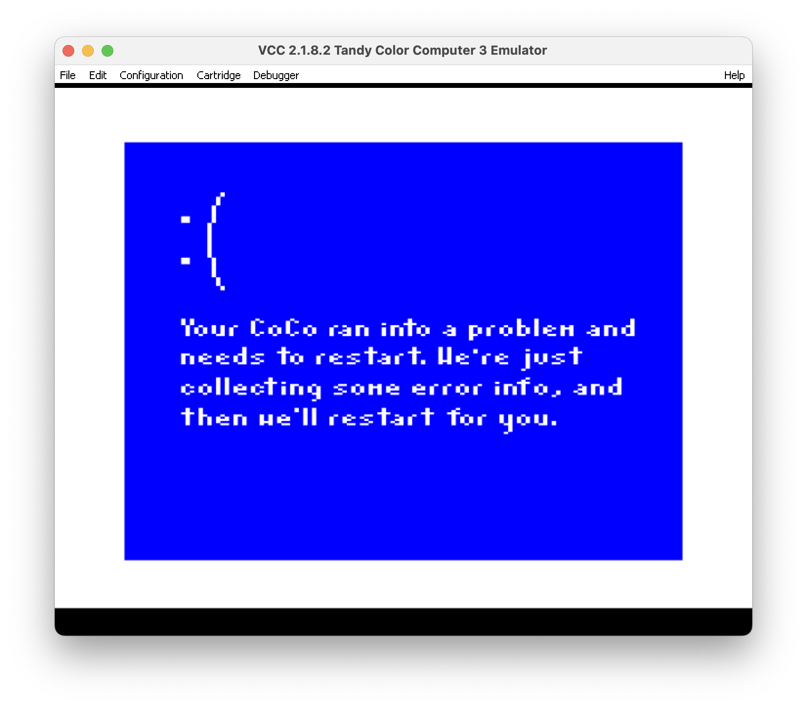
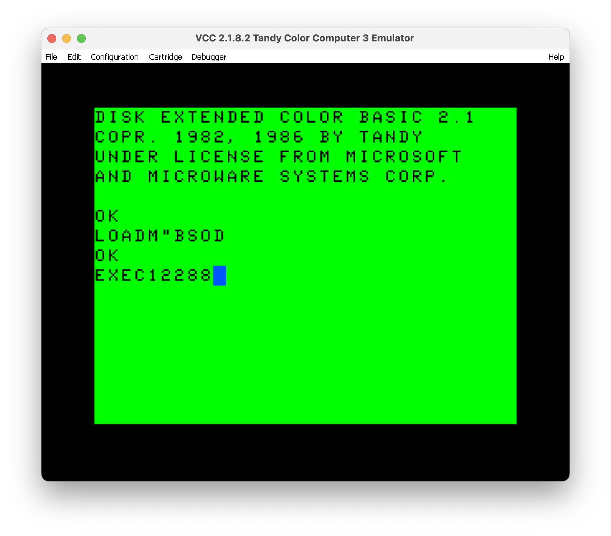

# CoCo Blue Screen of Death

I created this little parody after the fun CrowdStrike fiasco of 2024.



## Getting Started

To build this, you need [lwtools](http://www.lwtools.ca/) and
[toolshed](https://toolshed.sourceforge.net/ToolShed.html) installed and on your path. Documenting
that is beyond the scope of this README.

### Mac / Linux

The `dev_setup.sh` script sets up a Python3 environment in `.venv` and installs ImageIO to prepare
you for running `convert_image.py`. This script converts the `Problem.png` image to
`imagedata.asm`, generating 6809 assembly code from the PNG source code, and preparing it for a
mode 6C graphics display on the CoCo.

The general setup for you will be:

```
./dev_setup.sh
python convert_image.py
```

Compiling the assembly source and generating the disk image is done by `build.sh`.

```
./build.sh
```

This will generate `BSOD.DSK` ready to move to your SD card (CoCoSDC) or load into your emulator. 

# Running on your CoCo

Once you have the disk mounted, simply:

```
LOADM"BSOD.BIN
EXEC12288
```



